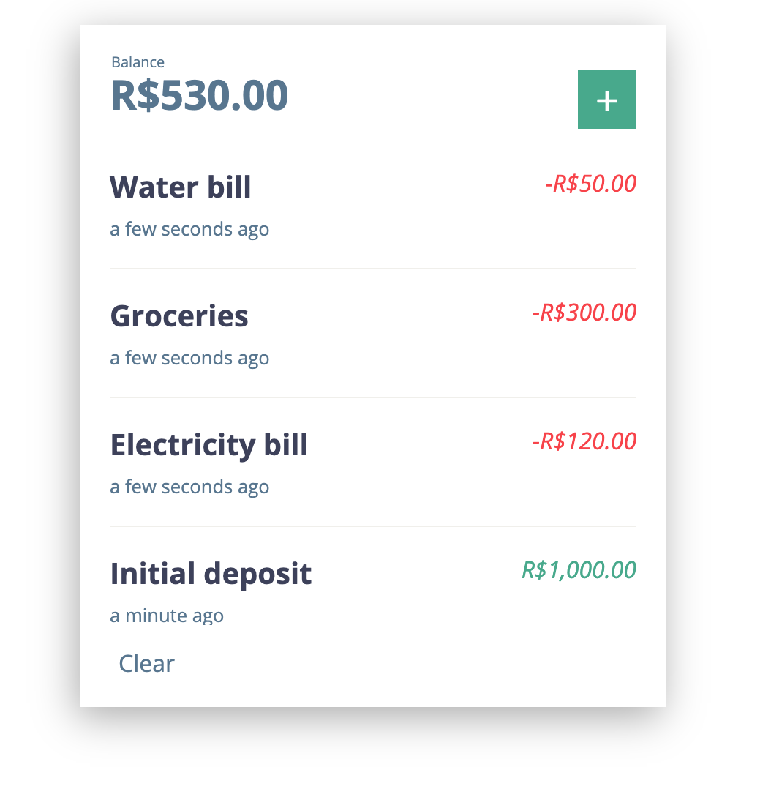
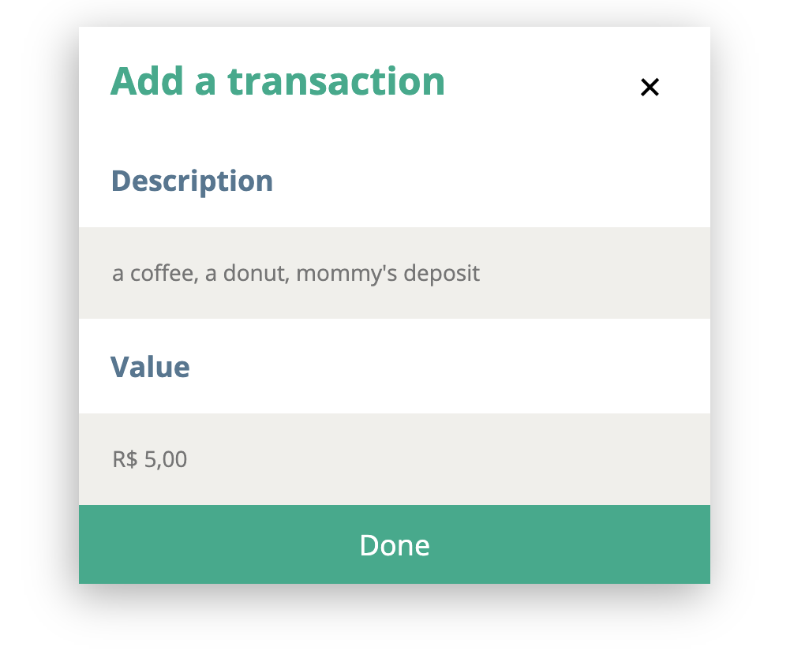

Transaction Manager
===========




Instalação
---

Basta ir na raiz do projeto e dar um `npm install` e tudo instala tranquilamente.
Não há nenhuma outra dependencia além das listadas no `package.json`, além de um
browser talvez e o Node.js, eu recomendo usar a versão LTS (atualmente o 12) em
diante.

Rodando
---

Mais uma vez, é bem simples, basta um `npm start`. O browser deve abrir automaticamente
mas caso não acontecer você pode ir em http://localhost:3000/.

Racional
---

Eu decidi criar uma aplicação simples em React, que implementasse os requisitos, que
o processo de desenvolvimento fosse rápido e que eu podesse ainda ter tempo de refinar
a UX do projeto.

O projeto foi iniciado usando o Create React App e continua usando o `react-scripts` para
automatizar boa parte do tooling, como building, teste e linting.

**Modelando os dados**

Baseado na lista de requisitos, em especial no um, inicialemente eu decidi que a aplicação
teria uma lista (um Array comum no JavaScript) com objetos que representariam as transações,
cada transação tem uma `description` e um `value`, onde um é uma `string` e o outro pode ser
um `number`. Dada as circunstancias, acredito que seria interessante usar `Decimal` como forma
de lidar com problemas de ponto flutuante, porém dada a adicional complexidade e o fato de não
estar listado nos requisitos preferi por não ter suporte inicialmente. Por fim, o estado global
poderia ser algo assim:

```js
[
  {
    description: 'a coffee',
    value: 2.55,
  },
]
```

Ainda nos requisitos é informado que deve se ordenar as transações em ordem decrescente.
Eu poderia apenas me basear na ordem em que os items que foram inseridos na lista, porém
ordenação ímplicita funcionando dessa forma pode ser um tanto imprevisível, por isso preferi
por adicionar um campo `createdAt` com o timestamp de quando foi inserida a transação, assim
indendente da ordem que os itens estejam na lista, podem ser organizados da forma necessária.

```js
[
  {
    description: 'a coffee',
    value: 2.55,
    createdAt: 1594082752581,
  },
]
```

Com tudo, as transações são listadas, e listas em React devem ter uma chave que permite uma
inserção ou remoção com boa performance. Assim é necessário adicionar uma chave para cada
transação para ser usada na lista. Preferi por usar um UUID direto no objeto, já que facilitaria
uma possível integração com outras coisas como um backend.

Por fim o estado global ficou modelado assim:

```js
[
  {
    id: '6d479ee8-0010-441d-bfc8-c27fc2bd7455',
    description: 'a coffee',
    value: 2.55,
    createdAt: 1594082752581,
  },
]
```

**Transações como React Hooks**

Com os dados modelados eu precisaria de alguma lógica para poder lidar com eles, cada vez que uma
transação é criada tem que adicionar o UUID e o timestamp. Cada vez que a lista for alterada eu tenho
que persistir, assim que iniciar a aplicação eu devo carregar as transações salvas no local storage e
ainda permitir alguma forma de limpar tudo, como feature mas também para facilitar na hora dos testes.

Dado isso eu encapsulei tudo eu um Hook que pode ser usado da seguinte forma:

```js
function Component() {
  const [transactions, addTransaction, clearTransactions] = useTransactions();
  
  ...
}
```

E o `useTransactions` lida com o resto.

**Como os testes foram modelados**

Os testes que foram definidos em `App.test.js` são baseados nos requisitos funcionais
definidos no documento de requisitos que me foi enviado. Inicialmente eu iterei sobre
cada um dos requisitos implementando os testes e depois o código de cada um deles.

Os outros testes dos componentes dentro do diretório `components` são para garantir
de forma esperada e que não "quebrem" enquanto estiverem sendo usados. Para esse projeto
eles são o equivalente a unit tests. Alguns requisitos funcionais também estão definidos
como testes unitários, mas porque seria mais fácil de implementar assim em alguns casos.

O nome dos arquivos de testes seguem o padrão de que componente estão testando algo como
`<componente>.test.js`.

**Estilos**

Inicialmente eu defini alguns componentes principais, que guardariam apenas o estilo, e
usaria essas classes para definir estilos mais gerais. Cada uma dessas foi para o `index.css`
e estilos que são exclusivos ficam em um arquivo com um nome semelhante ao do componente
como `<componente>.css`. Assim não se cria um estrutura de diretórios muito grande e ainda assim
os arquivos ficam sempre próximos uns dos outros na listagem.

Um componente normalmente tem uma classe CSS com o nome do componente e para estilos de
elementos específicos dentro do componente eu uso algo próximo do padrão BEM para
especificar. Algo como `.TransactionForm__close-btn` para definir o botão de fechar
do formulário de criar transações. Para modificadores dentro do CSS sempre adiciono junto com
o nome da classe que está sendo modificada, se o modificador for exclusívo dessa classe.

Coisas como cores e tamanhos base e cores eu defini em um arquivo `variables.css`, assim
pode-se alterar o tema do projeto de precisar alterar muita coisa. Apenas os tamanhos das
fontes ficaram de fora, por não ter padronizado o tamanho delas.

**Sobre o Ramda**

Ramda é uma biblioteca para programação funcional para JavaScript, decidi usar ela para
fazer interface com os componentes, como consigo implementar quase tudo que posso
fazer em JavaScript acabo deixando o código mais limpo devido a quantidade de sintaxe
que deixa de ser usada na criação do componente. Além disso aproveito a natureza da
programação funcional para evitar comportamentos imprevisíveis nas interfaces com
os componentes.

O primeiro caso que achei interessante foi para acessar o valor do input relacionado
a um evento que eu recebo. Ao invés de fazer isso:

```jsx
<Component
  onChange={(e) => setValue(e.target.value)}/>
```

Faço isso:

```jsx
const eventValue = pipe(prop('target'), prop('value'));

<Component
  onChange={pipe(eventValue, setValue)}/>
```

Para calcular o saldo:

```jsx
/* Puro JS */
const balance = transactions.map(t => t.value).reduce((a, b) => a + b, 0);

/* Com Ramda */
const balance = pipe(
  map(prop('value')),
  reduce(add, 0)`,
)(transactions);
```

**Por que não usei Redux?**

Ao invés de usar Redux ou outra lib para gerenciar estado eu usei apenas React Hooks, o
único estado global que a aplicação possui é a lista de transações e usar alguma lib de
gerenciamento de estado iria adicionar boilerplate considerável para algo assim.

**Por que não usei Sass?**

Adicionar Sass envolveria adicionar mais uma ferramente ao pipeline de build, que poderia
eventualmente aumentar o tempo de build e o tempo de desenvolvimento para um projeto
que o CSS não acaba sendo tão complexo e é bem fácil de lidar. Para projetos maiores
com interfaces mais complicadas seria mais interessante.

Além disso tem-se a complexidade de ser fazer o setup do `node-sass`.

**Por que não usei Bootstrap ou algo assim?**

Como mencionei anteriormente, o projeto é bem simples, e não acho tão necessário
assim uma ferramenta como Bootstrap se é possível implementar tudo somenete com CSS.
Apesar de alguns problemas de compatibilidade entre browsers, mas acredito que não venha
ao caso aqui.

**Sobre moedas e formatação**

Foi pedido que a moeda utilizada como base fosse explicitamente o Real, levando isso
em consideração com a formatação pensei que poderia ser interessante usar `Intl`, que
é nativo dos browsers modernos para lidar com a formatação de valores monetários.
A moeda usada é o Real, porém a aplicação formata baseada nas configurações do brower
onde a aplicação está funcionando.

Contribuindo
---

Até esse ponto você já deve ter se familirizado com as decisões de projeto e portanto
deve entender como o projeto está estruturado. Esse app foi criado usando o Create React
App e pode ser rodado e testado apenas com comandos básicos do npm como `npm test`, `npm start`
e `npm run build`.

Se precisar adicionar algum CSS externo, faça isso no `index.html` no diretório `public`. Componentes
devem ser adicionados em `src/components` e siga os padrões estabelecidos para nomes
de arquiivos, se você possui um componente chamado `Component`, você deve criar todos os
arquivos relacionados seguindo o mesmo padrão:

* `Component.js` - Para o componente em si;
* `Component.test.js` - Para os testes do componente;
* `Component.css` - Para os estilos relacionados ao componente.

Componentes devem estar contidos dentro do próprio arquivo se tiverem uso geral ou poderem
ser reusados de alguma forma. Hooks com efeitos globais ou que isolem alguma coisa podem ser
colocados no arquivo `effects.js`. E estilos globais em `index.css`.

Antes de abrir um Pull Request, garanta que a funcionalidade que você está adicionando está
coberta por testes, principalmente se essa for crítica no fluxo de funcionamento normal
da aplicação. Estruture os testes beseados nas interfaces e comportamentos das coisas
e evite contato com as partes internas do componente, prefira teste em blackbox.

Se seu Pul Request adiciona dependencias tente descrever e ponderar efeitos futuros e
vantagens que adicionar essa nova dependencia pode trazer. Além disso tente garantir
que a dependencia adicionada tem boa manutenção contínua.
